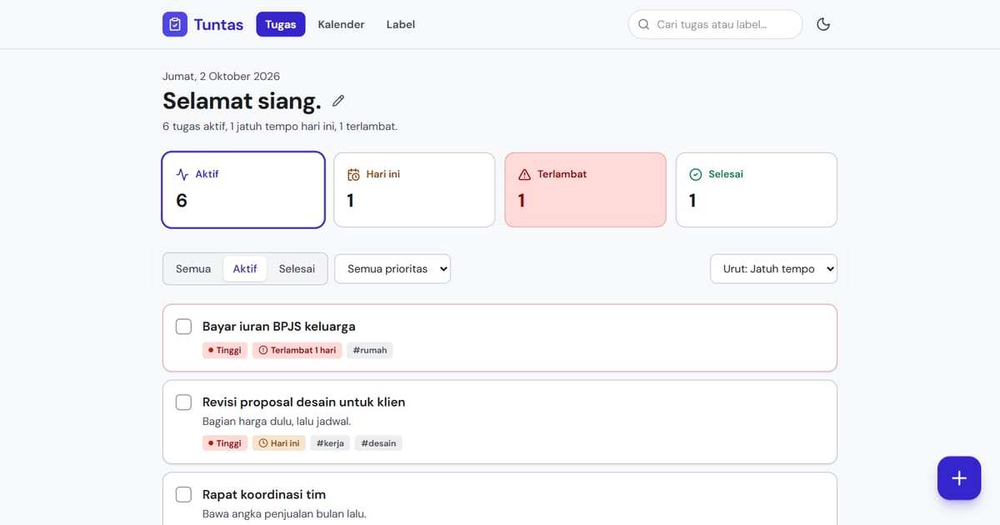

# Tuntas — Pengelola tugas dengan kalender

Pengelola tugas lengkap untuk urusan kerja dan rumah: prioritas, tenggat, label, dan kalender. Sapaan mengikuti jam WIB dan nama panggilan yang bisa diatur.

**Demo live:** https://todo-manager-ivory-seven.vercel.app



> Data tersimpan di `localStorage` peramban — tanpa akun dan tanpa server. Kunjungan pertama diisi data contoh yang tanggalnya relatif terhadap hari ini; tanggal dan jam dihitung dalam WIB.

## Fitur

- Kartu ringkasan yang juga menyaring: Aktif, Jatuh tempo hari ini, Terlambat, Selesai.
- Tenggat dibaca relatif ("Besok", "Terlambat 2 hari", nama hari) dan dibandingkan dengan tanggal WIB.
- Formulir tugas dengan tombol cepat Hari ini / Besok / Pekan depan dan label.
- `/kalender` — kalender bulanan dengan titik per tugas; centang langsung dari daftar per hari.
- `/label` — jumlah tugas per label, ganti nama atau lepas label dari semua tugas sekaligus; tautan ke daftar tersaring (`/?label=`).

## Halaman

`/` · `/kalender` · `/label`

## Teknologi

- Next.js 15.5 (App Router) dan React 19
- Tailwind CSS v4 (token tema + `.dark`)
- JavaScript
- Lucide (ikon)
- Font: DM Sans (next/font)
- SEO: metadata per halaman, Open Graph, JSON-LD, sitemap.xml, dan robots.txt

## Menjalankan secara lokal

```bash
npm install
npm run dev
```

Buka http://localhost:3000. Untuk build produksi: `npm run build` lalu `npm start`.

---

Bagian dari koleksi 3 aplikasi daftar tugas di [PortalTodo](https://portal-todo.vercel.app). Dibuat oleh [PintuWeb](https://pintuweb.com), jasa pembuatan website.
